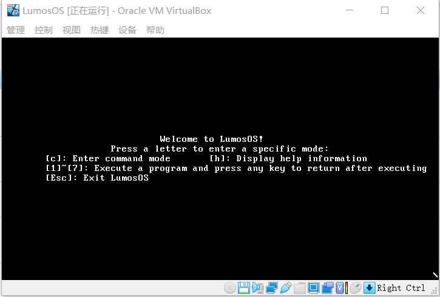
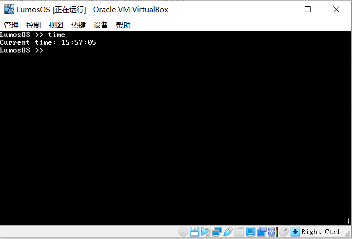
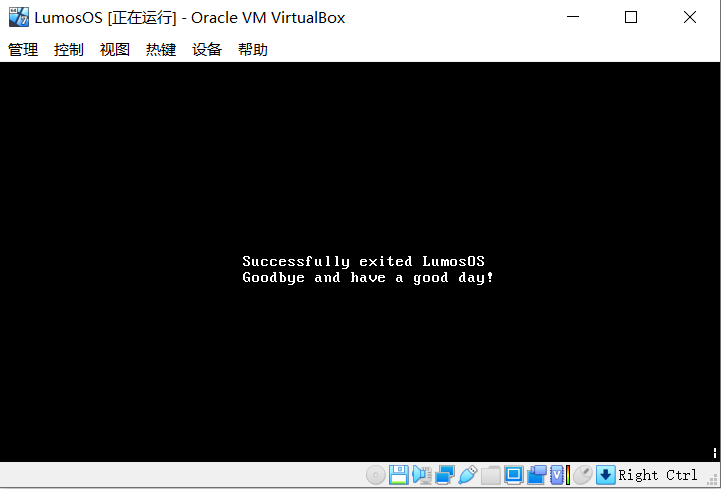

# LumosOS

16位实模式操作系统

## 运行环境

编译环境：Windows10 + DOSBOX 0.74 + TCC + TASM + TLINK + NASM
运行环境：Oracle VM VirtualBox

## 使用方式

* 对内核引导程序：``nasm -f bin boot.asm -o boot.bin``（BOOT.BAT）
* 对内核汇编代码：``tasm kernel.asm kernel.obj``（KERNEL.BAT）
* 对内核C代码：``tcc -mt -c -oos.obj os.c``（KERNEL.BAT）
* 对用户汇编代码：``nasm -f bin -o xxx.com xxx.asm``（USER.BAT）

完成上述步骤以后，使用``tlink /3 /t kernel.obj os.obj, kernel.com``将内核代码链接为COM文件，再使用``packing.c``文件将以上生成的所有BIN和COM文件打包至软盘。软盘生成后即可放入虚拟机中运行。

## 效果展示

开始界面

命令行界面

退出界面

